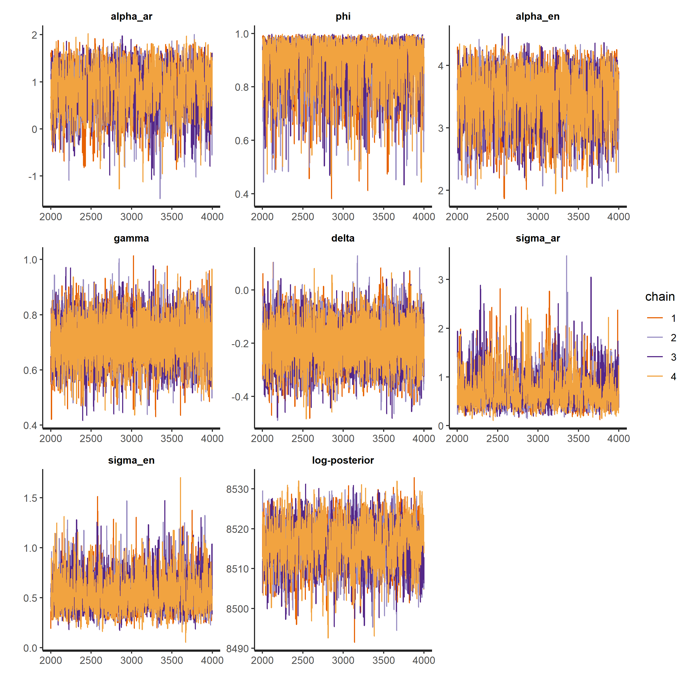
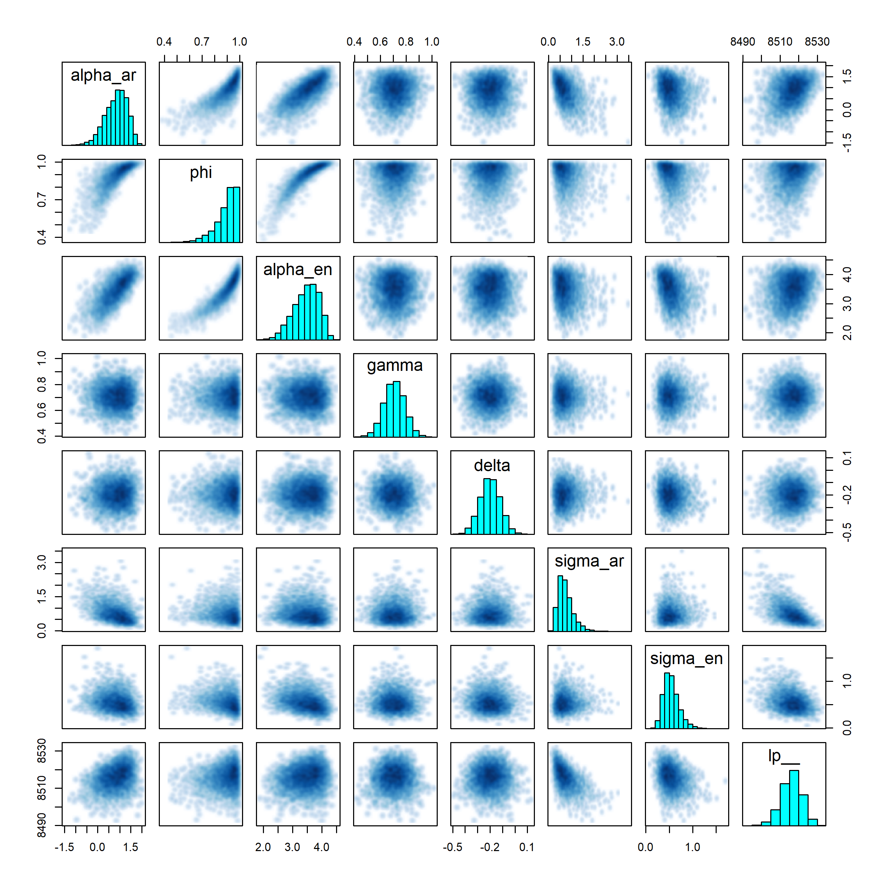
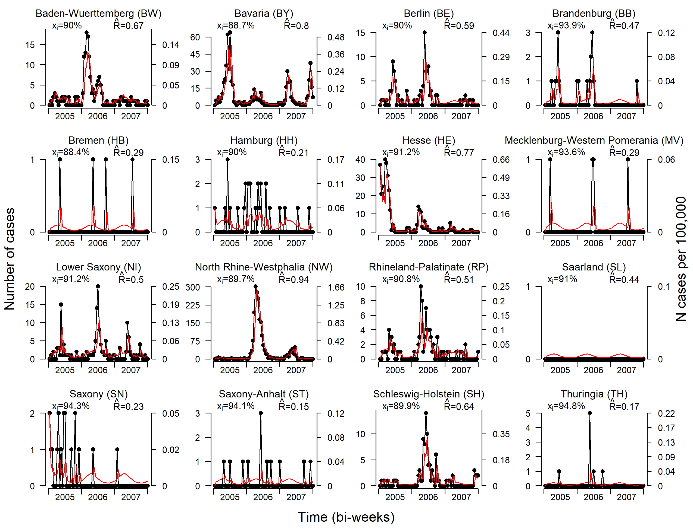
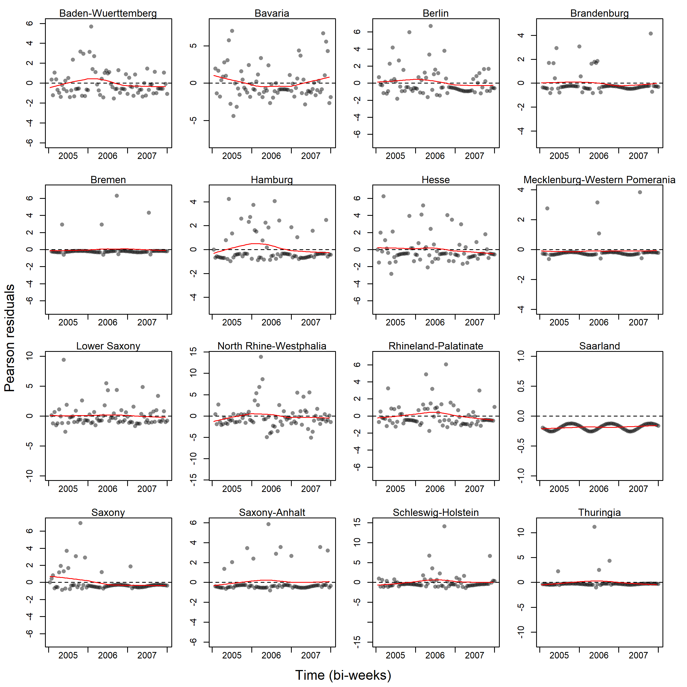
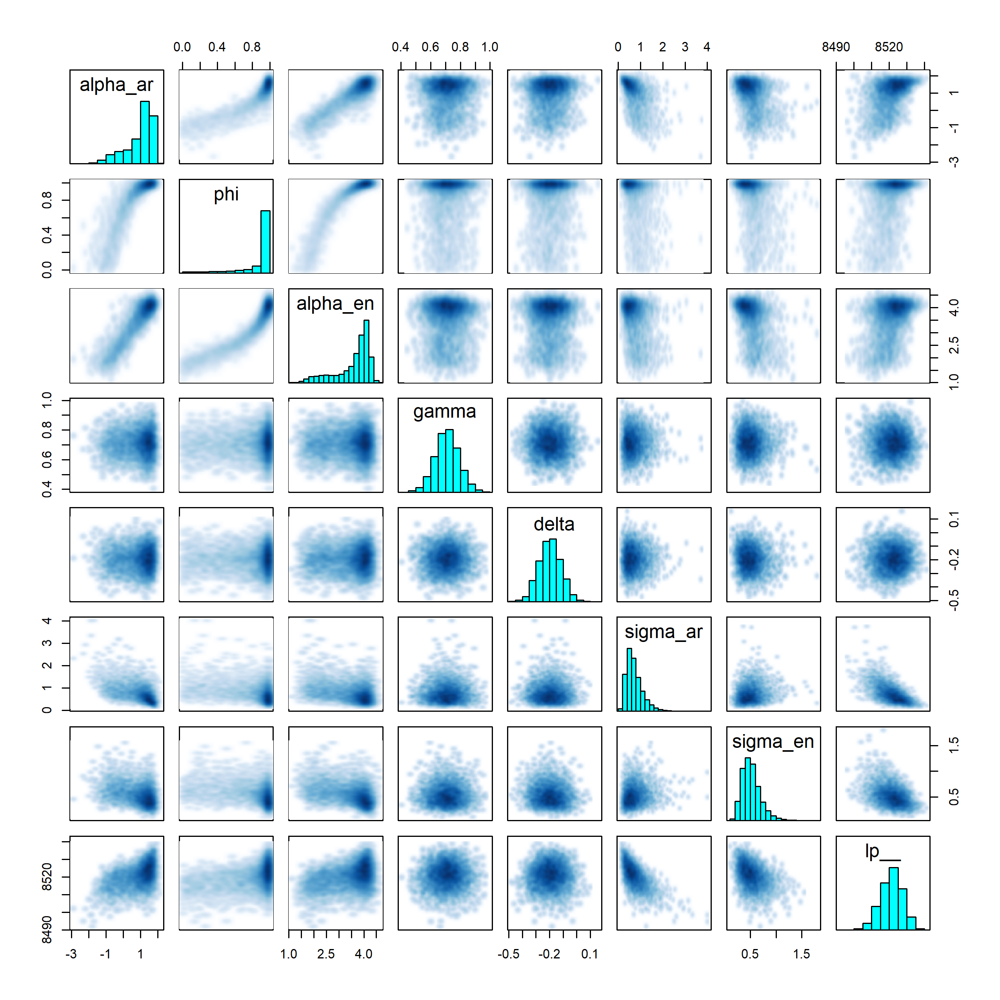
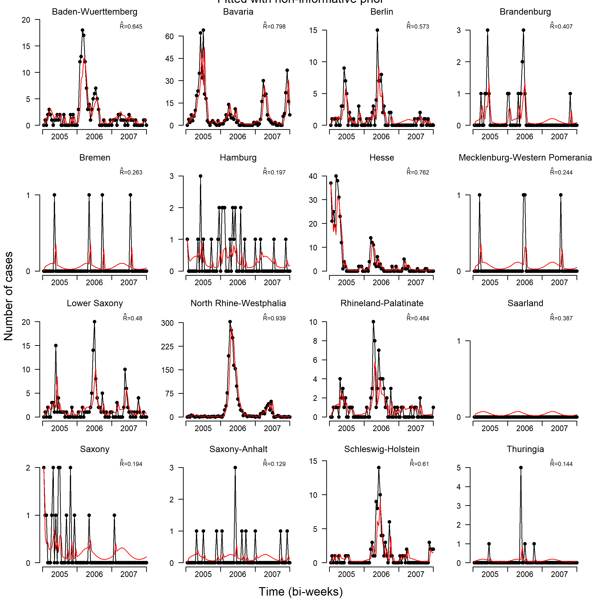
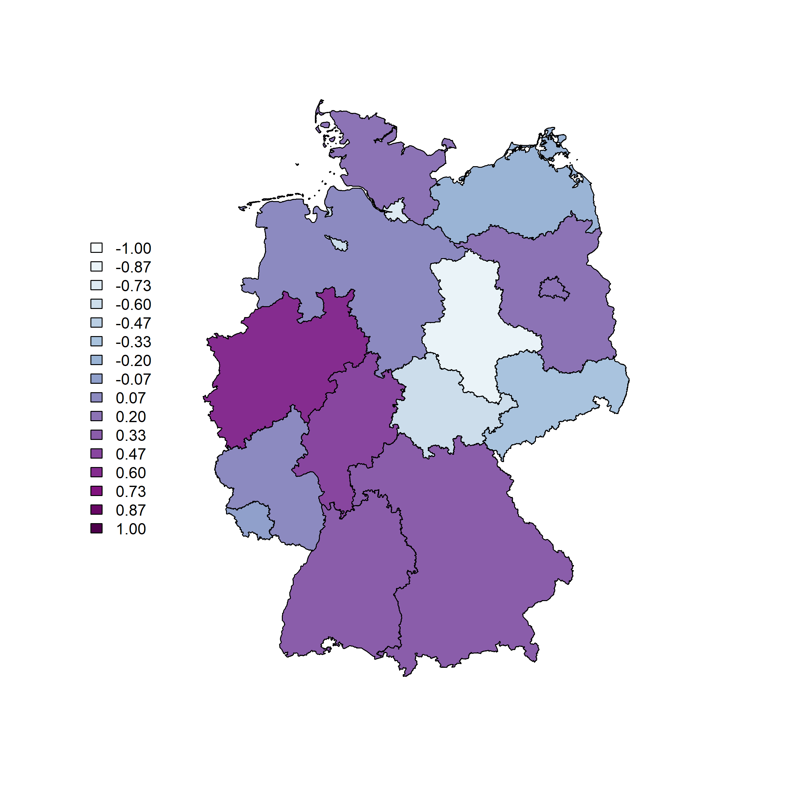
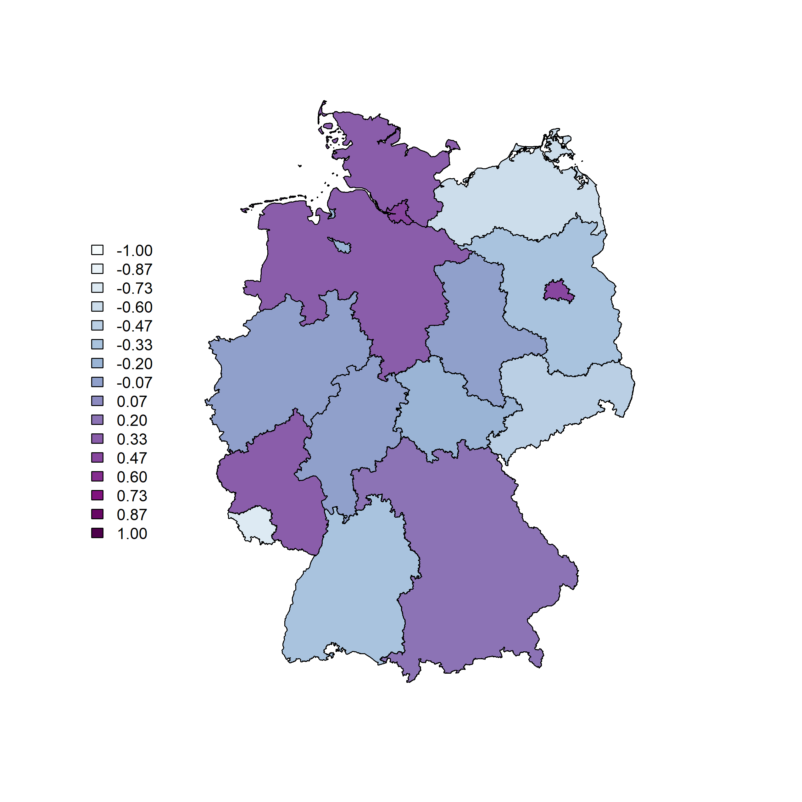
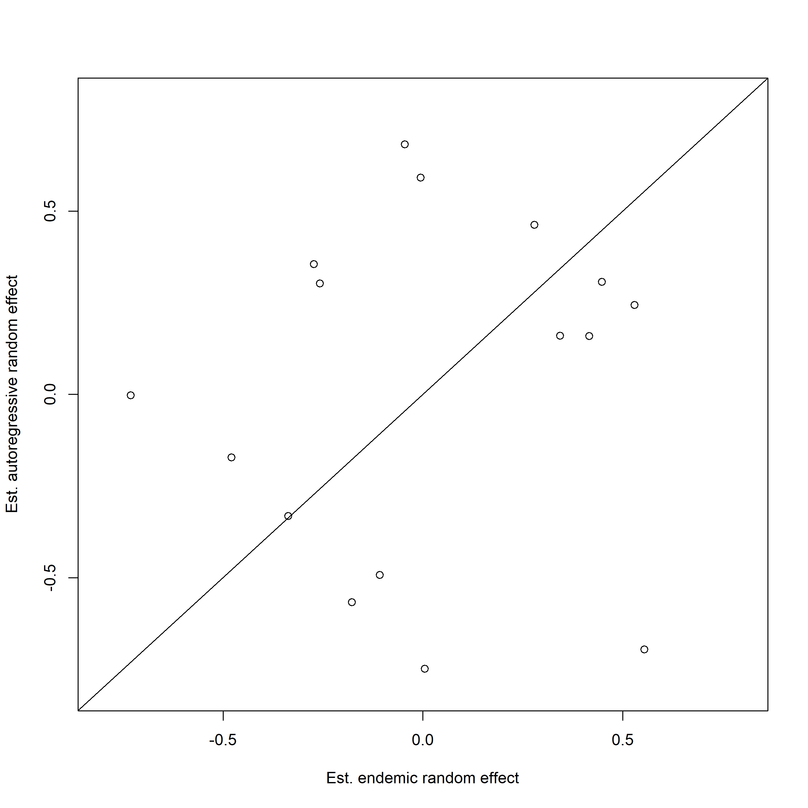
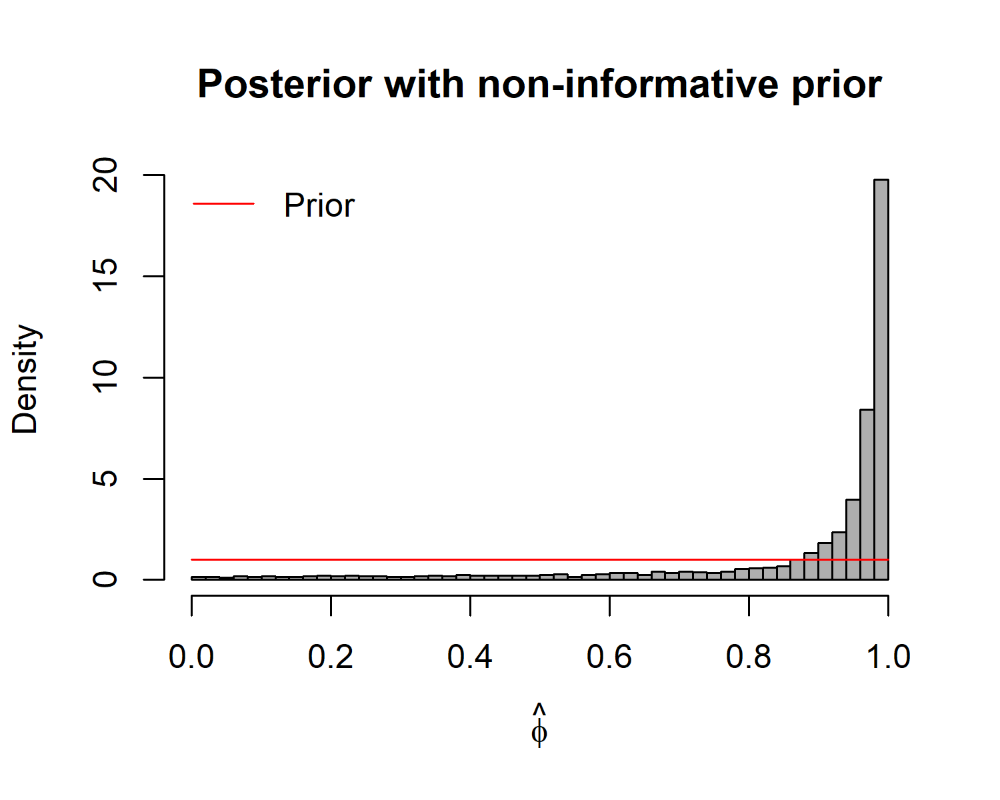

Analysis of Measles data in Germany
================
31 July, 2019

  - [Introduction and notes](#introduction-and-notes)
  - [Overview of Measles data](#overview-of-measles-data)
  - [Primary analysis in Stan](#primary-analysis-in-stan)
  - [Sensitivity analysis (non-informative
    priors)](#sensitivity-analysis-non-informative-priors)
  - [Code to specify model in Stan](#code-to-specify-model-in-stan)

# Introduction and notes

  - This file contains figures and analyses presented in \`\`Ecological
    inference for infectious disease data, with application to
    vaccination strategies", along with additional analyses that are
    discussed in detail in the primary
manuscript.

# Overview of Measles data

### Number of cases over time, across all of Germany


### Spatial distribution of total number of cases by state per 100,000 from 2005-2007.


### Estimated vaccination coverage

Below, we plot the estimated proportion of individuals with at least one
(left) and two (right) MMR vaccines.


### Observed bi-weekly incidence of reported cases:

<!-- -->

Number of measles cases and estimated vaccination coverage for the 16
German states from 2005-2007. MMR1 (MMR2) is the estimated vaccination
coverage for at least 1 (2) MMR vaccine, estimated from the school entry
examinations. Note this partially reproduces Table 1 from Herzog et al
2011.

``` 
                                State Population Total.Cases  MMR1  MMR2
1             Baden-Wuerttemberg (BW) 10,738,753         162 90.0% 75.6%
2                        Bavaria (BY) 12,492,658         606 88.7% 73.2%
3                         Berlin (BE)  3,404,037         104 90.0% 80.2%
4                    Brandenburg (BB)  2,547,772          18 93.9% 86.9%
5                         Bremen (HB)    663,979           4 88.4% 71.9%
6                        Hamburg (HH)  1,754,182          29 90.0% 80.5%
7                          Hesse (HE)  6,075,359         336 91.2% 78.1%
8  Mecklenburg-Western Pomerania (MV)  1,693,754           4 93.6% 88.0%
9                   Lower Saxony (NI)  7,982,685         144 91.2% 78.0%
10        North Rhine-Westphalia (NW) 18,028,745       2,036 89.7% 76.9%
11          Rhineland-Palatinate (RP)  4,052,860          85 90.8% 77.3%
12                      Saarland (SL)  1,043,167           0 91.0% 81.8%
13                        Saxony (SN)  4,249,774          18 94.3% 82.4%
14                 Saxony-Anhalt (ST)  2,441,787          12 94.1% 86.5%
15            Schleswig-Holstein (SH)  2,834,254          89 89.9% 79.3%
16                     Thuringia (TH)  2,311,140           8 94.8% 85.9%
```

# Primary analysis in Stan

### Strong prior for vaccine effect

To get the parameters for a beta distribution 90% of mass between 0.6
and 0.95:

``` r
priorch <- function(x,q1,q2,p1,p2){
  (p1-pbeta(q1,x[1],x[2]))^2 + (p2-pbeta(q2,x[1],x[2]))^2 }
# p1 and p2 define the upper and lower levels of the interval
p1 <- 0.05; p2 <- 0.95 
# q1 and q2 define the bounds of the interval
q1 <- 0.6; q2 <- 0.95 
## together, we interpret these values to say:
## we want 90% (p2-p1) of the mass to be between q1 and q2


opt <- optim(par=c(1,1),fn=priorch,q1=q1,q2=q2,p1=p1,p2=p2)
opt$par
```

    [1] 10.004052  2.449006

### Fit model and assess converged

``` r
measlesdat=list(I=16, # number of areas
                Ts=78, # number of time points
                Nobs=16*78, # total number of observations
                sin1=sin3, cos1=cos3, # inputs for seasonal terms
                y=t(Y), # observed cases dim I x Ts
                logNi=log(pop/sum(pop)), # log pop fraction
                X=X1, # vaccination coverage
                N=sum(pop), # total pop
                a=c(10, 2.5) # parameters specifying prior on phi
                ) 


pmt=proc.time()
fit <- stan(
        model_code = mod_ENre,
        chains=4, iter=4e3, 
        control=list(adapt_delta=0.99, max_treedepth = 15),
        seed=47,
        data = measlesdat)
(proc.time()-pmt)/60
```

``` 
       user      system     elapsed 
 0.34816667  0.01916667 22.06833333 
```

``` r
print(fit, pars=c("alpha_ar", "phi",  'alpha_en', 'gamma', 'delta', 'sigma_ar', 'sigma_en', "lp__"), probs=c(.025,.5,.975)) # 
```

    Inference for Stan model: c4c1ff19f358c6c9ee8fb5649733aef4.
    4 chains, each with iter=4000; warmup=2000; thin=1; 
    post-warmup draws per chain=2000, total post-warmup draws=8000.
    
                mean se_mean   sd    2.5%     50%   97.5% n_eff Rhat
    alpha_ar    0.83    0.01 0.50   -0.26    0.89    1.65  1185    1
    phi         0.89    0.00 0.09    0.66    0.91    0.99  2411    1
    alpha_en    3.46    0.01 0.43    2.55    3.51    4.15  1815    1
    gamma       0.71    0.00 0.08    0.55    0.71    0.86  8314    1
    delta      -0.20    0.00 0.08   -0.36   -0.20   -0.04  8890    1
    sigma_ar    0.74    0.01 0.35    0.28    0.68    1.58   948    1
    sigma_en    0.54    0.00 0.17    0.28    0.52    0.94  2121    1
    lp__     8516.04    0.16 5.56 8504.34 8516.32 8526.23  1217    1
    
    Samples were drawn using NUTS(diag_e) at Wed Jul 31 11:41:17 2019.
    For each parameter, n_eff is a crude measure of effective sample size,
    and Rhat is the potential scale reduction factor on split chains (at 
    convergence, Rhat=1).

``` r
print(fit, pars=c("alpha_ar", 're_ar', 'sigma_ar', "lp__"), probs=c(.025,.5,.975)) # 
```

    Inference for Stan model: c4c1ff19f358c6c9ee8fb5649733aef4.
    4 chains, each with iter=4000; warmup=2000; thin=1; 
    post-warmup draws per chain=2000, total post-warmup draws=8000.
    
                 mean se_mean   sd    2.5%     50%   97.5% n_eff Rhat
    alpha_ar     0.83    0.01 0.50   -0.26    0.89    1.65  1185 1.00
    re_ar[1]     0.44    0.01 0.31   -0.06    0.40    1.20  1003 1.01
    re_ar[2]     0.56    0.01 0.31    0.09    0.52    1.30   919 1.01
    re_ar[3]     0.32    0.01 0.32   -0.20    0.28    1.06   979 1.01
    re_ar[4]     0.31    0.01 0.44   -0.51    0.28    1.23  2219 1.00
    re_ar[5]    -0.62    0.01 0.70   -2.28   -0.50    0.45  3574 1.00
    re_ar[6]    -0.79    0.01 0.55   -2.09   -0.71    0.03  3393 1.00
    re_ar[7]     0.66    0.01 0.30    0.20    0.61    1.37   938 1.01
    re_ar[8]    -0.26    0.01 0.65   -1.74   -0.20    0.85  4525 1.00
    re_ar[9]     0.21    0.01 0.32   -0.32    0.18    0.97  1102 1.01
    re_ar[10]    0.77    0.01 0.30    0.32    0.73    1.49   897 1.01
    re_ar[11]    0.21    0.01 0.34   -0.37    0.17    0.98  1172 1.01
    re_ar[12]    0.02    0.01 0.84   -1.63    0.00    1.76  5310 1.00
    re_ar[13]   -0.43    0.01 0.54   -1.71   -0.38    0.46  4679 1.00
    re_ar[14]   -0.92    0.01 0.69   -2.57   -0.81    0.10  2560 1.00
    re_ar[15]    0.39    0.01 0.33   -0.15    0.34    1.14  1089 1.01
    re_ar[16]   -0.74    0.01 0.70   -2.40   -0.63    0.32  2898 1.00
    sigma_ar     0.74    0.01 0.35    0.28    0.68    1.58   948 1.00
    lp__      8516.04    0.16 5.56 8504.34 8516.32 8526.23  1217 1.00
    
    Samples were drawn using NUTS(diag_e) at Wed Jul 31 11:41:17 2019.
    For each parameter, n_eff is a crude measure of effective sample size,
    and Rhat is the potential scale reduction factor on split chains (at 
    convergence, Rhat=1).

``` r
print(fit, pars=c("alpha_en", 're_en', 'sigma_en', "lp__"), probs=c(.025,.5,.975)) # 
```

    Inference for Stan model: c4c1ff19f358c6c9ee8fb5649733aef4.
    4 chains, each with iter=4000; warmup=2000; thin=1; 
    post-warmup draws per chain=2000, total post-warmup draws=8000.
    
                 mean se_mean   sd    2.5%     50%   97.5% n_eff Rhat
    alpha_en     3.46    0.01 0.43    2.55    3.51    4.15  1815    1
    re_en[1]    -0.25    0.00 0.22   -0.69   -0.25    0.18  3052    1
    re_en[2]     0.34    0.00 0.22   -0.09    0.33    0.80  2304    1
    re_en[3]     0.58    0.00 0.25    0.10    0.57    1.08  2665    1
    re_en[4]    -0.31    0.00 0.33   -1.00   -0.30    0.29  4845    1
    re_en[5]    -0.10    0.00 0.36   -0.84   -0.09    0.59  7000    1
    re_en[6]     0.61    0.01 0.28    0.07    0.60    1.17  2769    1
    re_en[7]     0.00    0.00 0.25   -0.48    0.01    0.50  3735    1
    re_en[8]    -0.55    0.01 0.39   -1.39   -0.52    0.12  5261    1
    re_en[9]     0.37    0.00 0.22   -0.05    0.37    0.82  2502    1
    re_en[10]   -0.01    0.00 0.21   -0.41   -0.01    0.42  2462    1
    re_en[11]    0.45    0.00 0.25   -0.03    0.45    0.96  2909    1
    re_en[12]   -0.84    0.01 0.50   -1.99   -0.78   -0.05  3866    1
    re_en[13]   -0.40    0.00 0.29   -1.00   -0.40    0.13  4539    1
    re_en[14]   -0.03    0.00 0.28   -0.60   -0.02    0.52  5033    1
    re_en[15]    0.50    0.01 0.26   -0.01    0.49    1.02  2777    1
    re_en[16]   -0.24    0.00 0.32   -0.88   -0.23    0.36  5489    1
    sigma_en     0.54    0.00 0.17    0.28    0.52    0.94  2121    1
    lp__      8516.04    0.16 5.56 8504.34 8516.32 8526.23  1217    1
    
    Samples were drawn using NUTS(diag_e) at Wed Jul 31 11:41:17 2019.
    For each parameter, n_eff is a crude measure of effective sample size,
    and Rhat is the potential scale reduction factor on split chains (at 
    convergence, Rhat=1).

``` r
traceplot(fit, pars=c("alpha_ar", "phi",  'alpha_en', 'gamma', 'delta','sigma_ar', 'sigma_en', "lp__")) #
```

<!-- -->

``` r
pairs(fit, pars=c("alpha_ar", "phi",  'alpha_en', 'gamma', 'delta', 'sigma_ar', 'sigma_en', "lp__")) #
```

<!-- -->

### Parameter estimates

``` 
            50%   2.5%  97.5%
alpha_ar  0.891 -0.255  1.649
phi       0.914  0.661  0.989
alpha_en  3.508  2.554  4.153
gamma     0.708  0.549  0.861
delta    -0.200 -0.357 -0.042
sigma_ar  0.675  0.279  1.575
sigma_en  0.522  0.281  0.942
R0        2.437  0.775  5.200
```

### Model fits

<!-- -->

<!-- --><!-- -->

## Estimates of random effects


### Examine posterior distributions

<!-- -->

### Plot Pearson residuals

<!-- -->

# Sensitivity analysis (non-informative priors)

``` 
       user      system     elapsed 
 0.28900000  0.03016667 37.36666667 
```

    Inference for Stan model: c4c1ff19f358c6c9ee8fb5649733aef4.
    4 chains, each with iter=4000; warmup=2000; thin=1; 
    post-warmup draws per chain=2000, total post-warmup draws=8000.
    
                mean se_mean   sd    2.5%     50%   97.5% n_eff Rhat
    alpha_ar    0.96    0.03 0.79   -1.01    1.23    1.83   727    1
    phi         0.87    0.01 0.22    0.16    0.97    1.00  1032    1
    alpha_en    3.59    0.02 0.70    1.82    3.86    4.33   921    1
    gamma       0.71    0.00 0.08    0.55    0.71    0.87  7892    1
    delta      -0.20    0.00 0.08   -0.35   -0.20   -0.04  7919    1
    sigma_ar    0.72    0.01 0.37    0.24    0.65    1.62   744    1
    sigma_en    0.52    0.00 0.18    0.25    0.49    0.94  1589    1
    lp__     8521.21    0.21 6.28 8508.11 8521.56 8532.61   919    1
    
    Samples were drawn using NUTS(diag_e) at Wed Jul 31 12:24:55 2019.
    For each parameter, n_eff is a crude measure of effective sample size,
    and Rhat is the potential scale reduction factor on split chains (at 
    convergence, Rhat=1).

    Inference for Stan model: c4c1ff19f358c6c9ee8fb5649733aef4.
    4 chains, each with iter=4000; warmup=2000; thin=1; 
    post-warmup draws per chain=2000, total post-warmup draws=8000.
    
                 mean se_mean   sd    2.5%     50%   97.5% n_eff Rhat
    alpha_ar     0.96    0.03 0.79   -1.01    1.23    1.83   727    1
    re_ar[1]     0.41    0.01 0.33   -0.10    0.36    1.20   756    1
    re_ar[2]     0.52    0.01 0.33    0.04    0.46    1.33   697    1
    re_ar[3]     0.29    0.01 0.33   -0.23    0.24    1.09   806    1
    re_ar[4]     0.33    0.01 0.43   -0.48    0.30    1.25  1922    1
    re_ar[5]    -0.61    0.01 0.70   -2.34   -0.49    0.45  2467    1
    re_ar[6]    -0.78    0.01 0.56   -2.22   -0.70    0.07  2989    1
    re_ar[7]     0.64    0.01 0.31    0.18    0.59    1.40   764    1
    re_ar[8]    -0.23    0.01 0.63   -1.71   -0.17    0.85  5294    1
    re_ar[9]     0.20    0.01 0.33   -0.31    0.16    0.98   902    1
    re_ar[10]    0.74    0.01 0.31    0.29    0.68    1.52   703    1
    re_ar[11]    0.20    0.01 0.34   -0.37    0.16    0.97   979    1
    re_ar[12]    0.00    0.01 0.82   -1.69    0.00    1.68  6258    1
    re_ar[13]   -0.40    0.01 0.56   -1.72   -0.33    0.52  3623    1
    re_ar[14]   -0.88    0.02 0.71   -2.61   -0.75    0.15  1663    1
    re_ar[15]    0.36    0.01 0.34   -0.18    0.31    1.18   818    1
    re_ar[16]   -0.70    0.02 0.72   -2.44   -0.57    0.35  2035    1
    sigma_ar     0.72    0.01 0.37    0.24    0.65    1.62   744    1
    lp__      8521.21    0.21 6.28 8508.11 8521.56 8532.61   919    1
    
    Samples were drawn using NUTS(diag_e) at Wed Jul 31 12:24:55 2019.
    For each parameter, n_eff is a crude measure of effective sample size,
    and Rhat is the potential scale reduction factor on split chains (at 
    convergence, Rhat=1).

    Inference for Stan model: c4c1ff19f358c6c9ee8fb5649733aef4.
    4 chains, each with iter=4000; warmup=2000; thin=1; 
    post-warmup draws per chain=2000, total post-warmup draws=8000.
    
                 mean se_mean   sd    2.5%     50%   97.5% n_eff Rhat
    alpha_en     3.59    0.02 0.70    1.82    3.86    4.33   921    1
    re_en[1]    -0.27    0.00 0.22   -0.71   -0.27    0.17  2756    1
    re_en[2]     0.29    0.01 0.23   -0.13    0.28    0.79  1834    1
    re_en[3]     0.54    0.01 0.26    0.05    0.53    1.07  2087    1
    re_en[4]    -0.28    0.01 0.34   -1.01   -0.26    0.32  3940    1
    re_en[5]    -0.12    0.00 0.36   -0.87   -0.11    0.56  5317    1
    re_en[6]     0.56    0.01 0.28    0.04    0.55    1.14  1829    1
    re_en[7]    -0.01    0.00 0.25   -0.51   -0.01    0.48  3324    1
    re_en[8]    -0.52    0.01 0.39   -1.37   -0.48    0.16  3779    1
    re_en[9]     0.35    0.00 0.22   -0.06    0.34    0.79  2424    1
    re_en[10]   -0.04    0.00 0.22   -0.44   -0.05    0.41  2064    1
    re_en[11]    0.42    0.01 0.25   -0.06    0.42    0.94  2537    1
    re_en[12]   -0.80    0.01 0.51   -2.00   -0.73   -0.01  3123    1
    re_en[13]   -0.36    0.01 0.30   -0.99   -0.34    0.19  3295    1
    re_en[14]   -0.01    0.00 0.29   -0.60    0.00    0.53  4029    1
    re_en[15]    0.46    0.01 0.27   -0.05    0.45    1.00  2279    1
    re_en[16]   -0.19    0.01 0.32   -0.86   -0.18    0.41  3485    1
    sigma_en     0.52    0.00 0.18    0.25    0.49    0.94  1589    1
    lp__      8521.21    0.21 6.28 8508.11 8521.56 8532.61   919    1
    
    Samples were drawn using NUTS(diag_e) at Wed Jul 31 12:24:55 2019.
    For each parameter, n_eff is a crude measure of effective sample size,
    and Rhat is the potential scale reduction factor on split chains (at 
    convergence, Rhat=1).

<!-- --><!-- -->

### Examine model fits

<!-- -->

### Estimates of random effects

<!-- --><!-- --><!-- -->

### Examine posterior distributions

<!-- -->

# Code to specify model in Stan

Below, we print the code to define the Stan models fit in this document

``` r
mod_ENre='
data{
int<lower=1> I;          // number of areas
int<lower=1> Ts;         // number of times
int<lower=1> Nobs;    // number of total observations
int y[I, Ts] ;  // IxTs matrix of observations
real logNi[I];          // log population proportions 
vector[I] X;            // vector of Xi vacc cover
vector[Ts] sin1;           // vector of sin
vector[Ts] cos1;           // vector of cos
vector[2] a; //vector of parameters for the beta prior on phi
}
parameters{
real alpha_ar;  // AR component - intercept
real alpha_en;  // EN component - intercept
real gamma;     // sin component
real delta;     // cosine component 
real<lower=0, upper=1> phi;  // vaccine effect
vector[I] re_en; // EN random effects
vector[I] re_ar; // AR random effects
real<lower=0> sigma_ar; 
real<lower=0> sigma_en; 
}
model{
for(i in 1:I){
re_ar[i]~normal(0, sigma_ar);
re_en[i]~normal(0, sigma_en);
for(t in 2:Ts){
real muit;
muit = exp(alpha_ar+re_ar[i])*y[i, t-1] + exp(logNi[i] + alpha_en + re_en[i] + gamma*sin1[t] + delta*cos1[t]);
y[i, t] ~ poisson((1-phi*X[i])*muit);
}
}

//priors
alpha_ar ~ normal(0, 5);
alpha_en ~ normal(0, 5);
gamma ~ normal(0, 10);
delta ~ normal(0, 10);
phi ~ beta(a[1], a[2]);

}
generated quantities{
vector[Nobs-I] log_lik;
vector[I] ar;
vector[I] en;
vector[I] r; 
for(i in 1:I){
r[i] = exp(alpha_ar + re_ar[i])*(1-phi*X[i]); 
ar[i] = exp(alpha_ar + re_ar[i]);
en[i] = exp(alpha_en + re_en[i]);
for(t in 2:Ts){
real muit;
muit=exp(alpha_ar + re_ar[i])*y[i, t-1] + exp(logNi[i] + alpha_en + re_en[i] + gamma*sin1[t] + delta*cos1[t]);
log_lik[(i-1)*(Ts-1)+t-1 ] = poisson_lpmf(y[i, t] | (1-phi*X[i])*muit);
}
}
}
'
```
